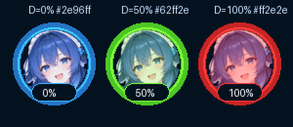

# FaceGuard 酱 · 鲸鱼娘

**二次元护眼距离提醒小工具**：读取摄像头 → 本地人脸检测 → 发现你**持续凑近屏幕**就弹窗提醒。

**全程离线**：没有云端 API、没有网络请求、不会在线下载模型；摄像头画面只在内存里实时处理，
不保存、不上传、不落盘。


---

## 下载直接用（免装 Python）

打包好的单文件 EXE 放在 **[`releases` 分支](https://github.com/redjoker2025/faceguard/tree/releases)**：

| 版本 | 文件 | 大小 | SHA256 |
|---|---|---|---|
| v2.1 | [FaceGuard.exe](https://github.com/redjoker2025/faceguard/blob/releases/FaceGuard.exe) | 70,900,559 字节（67.6 MiB） | `D92100A784AC81CB8CE53C82A026FD5DAF1AA0E42B4477C671F209A2C0D6DAC1` |

直链下载：`https://raw.githubusercontent.com/redjoker2025/faceguard/releases/FaceGuard.exe`

校验下载是否完整（PowerShell）：

```powershell
Get-FileHash .\FaceGuard.exe -Algorithm SHA256
# 应输出 D92100A784AC81CB8CE53C82A026FD5DAF1AA0E42B4477C671F209A2C0D6DAC1
```

- 运行环境：Windows 10 / 11（64 位），无需安装 Python；
- 首次启动会先解压到 `%TEMP%\_MEIxxxxx`，慢几秒属正常；
- 未签名的 PyInstaller 单文件 EXE 被 SmartScreen / 杀软误报是常态，加白名单或点「仍要运行」即可。

## 它做什么

- **本地人脸检测**：OpenCV 自带 Haar 级联（模型 <1MB），CPU 单线程即可实时，无需 GPU；
- **靠近判定**：不看你离屏幕几厘米，而是看「人脸相对你自己正常坐姿的放大倍数」——
  EMA 平滑 + 自适应基线 + 连续多帧确认 + 冷却期，三重抗抖动，挥手/打喷嚏不会误报；
- **三重提醒**：鲸鱼娘弹窗（自动 9 秒关闭）＋ 屏幕右上角悬浮字幕 ＋ 两声提示音，都可单独开关；
- **最小化照常工作**：检测在后台线程跑，最小化后弹窗、悬浮字幕、悬浮球都正常工作；
- **悬浮球**：最小化后桌面右下角出现一只鲸鱼娘，**颜色随距离由蓝渐变到红**（见下）。

## 蓝色主题与悬浮球

界面是深海蓝渐变主题（`#0b3d6b → #04121f`），面板/滑块/按钮/进度条/弹窗统一蓝调。
最小化主窗口后，右下角出现立绘裁成的圆形头像悬浮球，**外面那圈光环的颜色就是实时距离**：



| 悬浮球 | 含义 |
|---|---|
| 🔵 蓝色光环 + 0% 附近 | 离屏幕远 / 画面里暂时没人脸，很安全 |
| 🟢🟡 青 → 绿 → 黄 | 逐渐靠近（颜色沿 HSV 色相 210°→0° 插值，不会经过发灰发紫的中间色） |
| 🟠 橙色 + 60~80% | 接近触发线了，鲸鱼娘开始紧张 |
| 🔴 红色光环 + 100% | 贴脸报警！光环最亮、头像整体泛红 |

操作：**拖动**移动位置（会记住）、**悬停**看百分比和鲸鱼娘的心情、**双击**回到主窗口、
**右键**菜单（回到主窗口 / 暂停检测 / 退出）；不想要就在界面上取消勾选「最小化时显示悬浮球」。

> 球心的百分比 = 距离水平 = 人脸相对基线的放大倍数 ÷ 触发阈值，
> 所以它是**相对你自己正常坐姿**的比值，不是绝对厘米数。

## 目录结构

| 路径 | 说明 |
|---|---|
| `face_guard.py` | 全部源码（单文件，含详细注释） |
| `assets/whale_girl.png` | 鲸鱼娘半身立绘（透明 PNG，大尺寸场合用） |
| `assets/whale_girl_head.png` | 鲸鱼娘头部方形特写（透明 PNG，小尺寸图标/悬浮球用） |
| `artwork/whale_girl_source.png` | 立绘原图（抠图脚本的输入） |
| `tools/make_mascot.py` | 抠图脚本（从原图生成上面两张透明 PNG + 验证图） |
| `build.bat` | 一键打包脚本（装依赖 → 定位模型 → PyInstaller 打包） |
| `FaceGuard.spec` | PyInstaller 配置（模型与立绘的 `--add-data` 都写好了） |
| `docs/` | README 用的渲染图 |
| `requirements.txt` | pip 依赖清单 |

## 快速开始

### 1. 环境

- Windows 10 / 11（64 位）；Python 3.9 ~ 3.14（64 位，安装时勾选 *Add Python to PATH*）
- 装依赖（只有三个，无 GPU 要求、无需联网下模型）：

```bat
pip install -r requirements.txt
```

| 包 | 用途 | 备注 |
|---|---|---|
| `opencv-python-headless` | 摄像头读取 + Haar 人脸检测 + 抠图脚本 | 无 GUI 版体积更小、避开 Qt 插件冲突；和 `opencv-python` 不要同时装 |
| `pillow` | 摄像头帧刷进 Tkinter 画布；立绘缩放、圆形蒙版、颜色薄雾 | 算法不依赖它 |
| `pyinstaller` | 仅打包 EXE 时需要 | 平时运行程序不需要 |

Tkinter 是 Python 标准库；`numpy` 会随 opencv 自动装上。

### 2. 运行

```bat
python face_guard.py
```

点 **▶ 启动摄像头**，程序先用约 2 秒学习你当前的坐姿作为**基线**，之后凑近就会提醒。

### 3. 打包成单文件 EXE

**方法一：一键脚本（推荐）** —— 双击 `build.bat`，它做四件事：装依赖 → 检查立绘素材 →
用 `python face_guard.py --cascade-path` 定位 opencv 里的人脸模型 → 调 PyInstaller 打包。
产物：`dist\FaceGuard.exe`。

**方法二：用 spec（仓库已带一份配好的）**

```bat
python -m PyInstaller --noconfirm --clean FaceGuard.spec
```

**方法三：手动命令**

```bat
:: 1. 先拿到人脸模型在你机器上的绝对路径（程序内置了这个查询入口）
python face_guard.py --cascade-path
:: 假设输出：C:\Python312\Lib\site-packages\cv2\data\haarcascade_frontalface_default.xml

:: 2. 打包（模型和立绘都要 --add-data 进去）
python -m PyInstaller --noconfirm --clean --onefile --windowed --name FaceGuard ^
  --add-data "C:\Python312\Lib\site-packages\cv2\data\haarcascade_frontalface_default.xml;." ^
  --add-data "assets;assets" ^
  face_guard.py
```

PowerShell 用单行版（`^` 换行符在 PowerShell 里不认）：

```powershell
python -m PyInstaller --noconfirm --clean --onefile --windowed --name FaceGuard --add-data "<模型路径>;." --add-data "assets;assets" face_guard.py
```

#### 打包踩坑清单

1. **模型必须 `--add-data` 进 EXE**，否则打包后报「找不到人脸模型」。程序用 `sys._MEIPASS`
   （onefile 的解包目录）找它，这条路已写好，你只要别漏 `--add-data`。
2. **`--add-data` 的分隔符在 Windows 是 `;`**（Linux/macOS 才是 `:`）。
3. **`--windowed`（等价 `--noconsole`）隐藏黑窗**：没有控制台后，崩溃信息写到 EXE 同目录的
   `face_guard_error.log`——「双击没反应」时先看这个文件。
4. **推荐 `opencv-python-headless`**：比完整版小十几 MB，且避开 cv2 自带 Qt 插件在打包后的冲突。
5. **用 pip 装 opencv，别用 conda 的**：conda 版目录布局不同，`cv2.data` 经常缺失。
6. **杀毒软件 / SmartScreen 误报**：未签名的 PyInstaller onefile EXE 被误报是常态，
   加白名单即可；介意可以签名，或加 `--noupx`。
7. **EXE 的位数 = 打包用 Python 的位数**：64 位 Python 打出的 EXE 只能跑 64 位系统。
8. **首次启动慢几秒正常**：onefile 会先解压到 `%TEMP%\_MEIxxxxx`。
9. **分发前在一台没装 Python 的电脑上双击验证**：确认模型、摄像头、立绘都正常。
10. **立绘也要一起打包**：`--add-data "assets;assets"`（spec 里已写好 `('assets', 'assets')`）；
    漏了也不会崩，程序会退回 Canvas 矢量画法，只是看不到立绘。
11. **换立绘不用改代码**：把 `assets/` 里的 PNG 换成同名新图即可，程序会按高度等比缩放。
12. **想再瘦身**：可把模型换成 `lbpcascade_frontalface.xml`（约 70KB，更快但精度略低）；
    含 OpenCV 本体的常规体积就是 60~70MB。

## 使用说明

1. 双击 `FaceGuard.exe`（或 `python face_guard.py`），点 **▶ 启动摄像头**；
2. 画面上会框出你的人脸并显示宽度占比；程序先用约 2 秒学习你的**基线**坐姿；
3. 人脸比基线放大到超过阈值、且连续多帧确认后触发提醒：鲸鱼娘弹窗（9 秒自动关）＋
   右上角悬浮字幕（6 秒消失）＋ 两声提示音；
4. 报警后进入**冷却期**，冷却内不重复报警；冷却结束你仍然贴脸，会再提醒一次；
5. 最小化主窗口后**悬浮球上岗**，检测继续跑，提醒照常弹；
6. 退出直接点右上角 ×，摄像头会自动释放。

### 参数怎么调

| 控件 | 含义 | 调参建议 |
|---|---|---|
| 靠近触发阈值 | 人脸相对基线放大多少倍触发（1.05~1.60，默认 1.25） | 误报多 → 调大；太迟才报 → 调小 |
| 触发灵敏度 | 报警前需连续确认的帧数（1~10，默认 5 → 连续 7 帧） | 晃动误报 → 调低；想秒报 → 调高 |
| 报警冷却秒数 | 两次报警最小间隔（5~120 秒，默认 30） | 按需即可 |
| 弹窗 / 悬浮字幕 / 提示音 | 三种提醒方式的开关 | — |
| 最小化时显示悬浮球 | 悬浮球总开关 | 嫌挡视线就关掉 |
| 设备编号 | 摄像头索引（默认 0 = 自带摄像头） | 外接摄像头打不开时试 1、2 |

### 边界情况处理

| 场景 | 程序行为 |
|---|---|
| 摄像头打开失败 / 被占用 / 无权限 | 主线程弹窗说明原因与排查步骤，界面复位可重试 |
| 画面里没有人脸 | 不触发提醒，状态栏提示，连续帧计数清零；悬浮球回到蓝色 0% |
| 单帧晃动 / 突变 | EMA 平滑 + 连续多帧确认 + 太远（＜8% 画面宽）不参与判定，三重过滤防误报 |
| 长时间贴脸不动 | 基线冻结 + 冷却期内不重复报警，冷却结束仍贴近才再提醒 |
| 主窗口最小化 | 检测线程继续运行，弹窗/悬浮字幕置顶弹出；悬浮球出现并实时变色；画面刷新暂停省 CPU |
| 运行中摄像头被拔出 | 连续读取失败约 1 秒后自动停止并弹窗 |
| 屏幕分辨率小 / 系统缩放 125%+ | 启动时自动收窄摄像头画面，保证所有按钮都在屏幕内 |
| 系统不支持窗口色键透明 | 悬浮球/悬浮字幕退化成深蓝方块底，功能不受影响 |
| 立绘素材缺失或损坏 | 自动退回 Canvas 矢量画的鲸鱼娘，界面不会开天窗 |

## 立绘素材

`assets/` 下两张透明 PNG 是从一张立绘截图上抠出来的，抠图脚本已入库：
`tools/make_mascot.py`（输入 `artwork/whale_girl_source.png`，输出两张 PNG + `.scratch/` 验证图）。

```bat
python tools/make_mascot.py
```

算法（为什么这么抠）：

1. **裁掉卡片边框**：截图是带圆角描边的卡片，先切掉上/左/右各 11px 的边框线，
   否则边框会挡住背景的连通性；
2. **洪水填充去背景**：从四边所有「浅色低饱和」的像素出发做**浮动容差**（6 级）填充 ——
   浮动容差是跟邻居像素比，所以能顺着白→淡紫的背景渐变蔓延，却会被蕾丝的深灰描边挡住
   （关键：白色蕾丝不会被当成背景吃掉）；
3. **清理**：最外 5 圈里残留的浅灰边框线判成背景；只保留最大连通域；闭运算补掉蕾丝小镂空；
4. **去白边**：边缘半透明像素的颜色是按白底混出来的，按 `fg = (obs - (1-a)·白)/a` 反解回真实颜色，
   否则贴到深蓝界面上会有一圈白边；
5. **导出**：`whale_girl.png`（半身像，148×230）+ `whale_girl_head.png`（按脸裁的方形特写，
   148×148，专门给 40px 左右的小图标用——半身像缩到 40px 就看不清脸了）。

验证图会输出到 `.scratch/mascot_check_*.png`（洋红底对白色脏边最灵敏）。

## 隐私说明

- 代码里**没有任何网络请求**，不下载、不上传、不含遥测；
- 人脸检测模型（`haarcascade_frontalface_default.xml`，OpenCV 官方自带级联）随 EXE 内置；
- 摄像头帧只在内存里完成「缩放 → 灰度 → 检测 → 画框」，进程关闭即释放，不落盘；
- 鲸鱼娘立绘是两张随 EXE 内置的 PNG，不需要联网获取。

## 常见问题

- **双击 EXE 没反应**：看同目录 `face_guard_error.log`；九成是杀软拦截或模型没打进去。
- **画面黑屏**：检查 Windows 隐私设置是否允许桌面应用访问相机；或摄像头被别的程序占用。
- **从不太报 / 报太勤**：按「参数怎么调」调阈值与灵敏度，状态栏的「距离水平 vs 触发线」能直观看到差距。
- **最小化后没看到悬浮球**：确认「最小化时显示悬浮球」是勾选状态；它默认在**右下角、任务栏上方 120px** 处，
  多显示器时可能出现在主显示器边缘。
- **悬浮球四个角有黑方块**：系统不支持窗口色键透明（非 Windows 或老 Tk），不影响功能。
- **悬浮球颜色一直是蓝的**：说明检测线程没在跑（没点启动，或摄像头报错停了），颜色只在有人脸时才随距离变化。

## 版本历史

| 版本 | 主要变化 |
|---|---|
| **v2.1** | 鲸鱼娘换成**真立绘**（抠图透明 PNG，`tools/make_mascot.py` 可复现）；悬浮球改为「圆形头像 + 距离色光环」；立绘缺失自动退回矢量画法 |
| **v2.0** | 全面换肤成深海蓝渐变主题；新增**最小化悬浮球**（颜色由蓝到红表示远近，可拖动/悬停/双击回主窗口/右键菜单）；界面文案鲸鱼娘化 |
| **v1.0** | 首个版本：摄像头 + Haar 人脸检测 + 靠近判定 + 弹窗/悬浮字幕/提示音，粉色主题 |

## 许可证

[Apache License 2.0](LICENSE)
